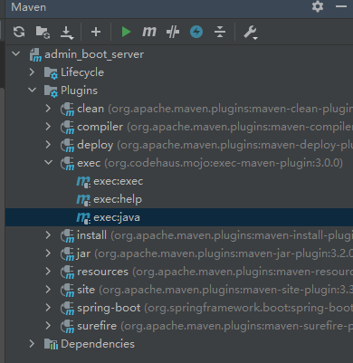

# **Admin管理框架Springboot后台服务**

## 项目依赖
由于使用了Lombok，IDE需要安装Lombok插件

需要额外依赖项目  
cn.solwind.dbgenerator  
cn.solwind.common

## Build Setup

## DB
数据库建表语句在doc/DB中  
新表可以通过修改/resources/mybatis-generator.xml中数据库配置，然后使用Maven插件exec:java反向生成entity和Mapper  
  
_注意：需要依赖cn.solwind.dbgenerator，已解决java文件合并问题，增加Lombok和TK.Mapper支持_

## Swagger
访问地址：http://127.0.0.1:{port}/swagger-ui/index.html  
生产环境务必关闭swagger！

## 未解决的问题
- [ ] SpringSecurity待实现根据数据库配置url进行权限判定

## 需注意的问题
